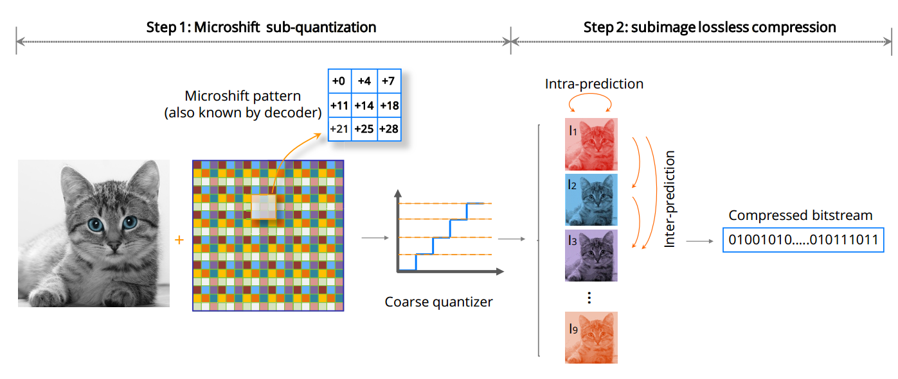
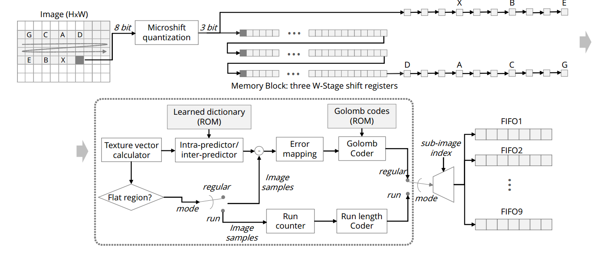

# *Microshift*: An Efficient Image Compression Algorithm for Hardware

**This is the Matlab and Verilog implementation of the TCSVT paper "Microshift: An Efficient Image Compression Algorithm for Hardware"**

*IEEE link: <https://ieeexplore.ieee.org/document/8529272>*


## Description

*Microshift* is a lossy image compression algorithm that can be efficiently implemented on Hardware with extremely low power consumption. 

- When testing on dataset, it can compress images to **1.25 BPP** with a resulting quality that outperforms state-of-the-art on-chip compression algorithms (**PSNR=33.16, SSIM=0.90**). 
- An efficient VLSI architecture is proposed and is implemented on an FPGA. 
- The results on the ASIC design further validate the low hardware complexity and high power efficiency.
- Our method is promising for low-power *wireless vision sensor networks* (WVSN).


## Matlab code

#### Example of image compression and decompression

First, add the Toolkits folder and its subfolders to the searching path. 

```matlab
addpath(genpath('.Toolkits/'))
```

User can run the sample for compression and decompression by running:

```matlab
run example_testbench_low_power.m
```

Note that this Matlab code is written in exactly the same style as the hardware implementation, and this causes long run-time. To speedup, we compile the compression file (`compression_hdl_lowpower.m`) into MEX file. We pre-compiled the MEX on windows, and users can compile the MEX file if using a different Matlab environment:

```matlab
run compression_hdl_lowpower_coder_script.m
```

We provide a faster testbench that includes the MEX compression:

```matlab
run example_testbench_low_power_faster.m
```

We provide two decompression modes as described in the paper:

- `decompression_mode = 1`: faster decompression

- `decompression_mode = 2`: MRF decompression, features better quality at the cost of longer run-time

#### Verilog generation

We can use HDLcoder to automatically generate the Verilog file from our compression Matlab file (`compression_hdl_lowpower.m`) by:

```matlab
open HDL_generation.prj
```


## Verilog code

We take use of the generated Verilog files and synthesize the design from it.  We use the *Global Foundry 180nm process*. One can synthesize the design using Design Vision by running the following script:

```bash
dc_shell-t -f dc_new_216.tcl | tee log&
```

*Note:* make sure *.synopsys_dc_setup* is correctly set up so that the Design Vision can locate the foundry files.

#### Project structure

```
verilog
└───pre_synthesis
│   │   image.dat: image file
│   │   subimage*.dat: simulation outputs generated from Modelsim
│   │	*.v: Verilog design files; compression_fifo_hdl.v is the top design
└───post_synthesis: synthesized netlist from Design Vision
└───post_layout: post-layout netlist after routing in Encounter
└───script: contains the scripts for the Modelsim simulation
└───inout_images: testing images
└───matlab_files: contain the necessary MATLAB files for the project
└───image.dat: image binary file
└───ImageData_generation.m: matlab file that generates the image binary data
```

#### Pre-synthesis simulation

Directly run the Matlab script

```matlab
run test_framework.m
```

- choose the image name: e.g. `image_name = input_images/elaine.bmp`
- choose the Modelsim simulation mode: set the `GUI_mode` variable
  - GUI mode: visualize the waveform in the Modelsim
  - command mode: this features faster Modelsim simulation

#### Post-synthesis simulation

Run the script `test_framework.m` for the joint simulation:

- choose the image name: e.g. `image_name = input_images/elaine.bmp`
- choose the Modelsim simulation mode by setting the `GUI_mode` variable
  - GUI mode: visualize the waveform
  - command mode: faster simulation

> **Explanation for the script `test_framework.m`**
>
> - the function `ImageData_generation.m` will generate the `image.data` files according to the chosen image content
> - Modelsim simulation is run by calling the `.do` script in the Matlab
> - after the simulation ends, the Modelsim will generate the compressed bitstream files `subimage*.dat` 
> - `test_decompress` is called to decompress the image from the bitstream files
>

You can simulate the synthesized netlist through through the following step:

- change to the directory `post_synthesis/`
- start the Modelsim in the terminal: `vsim`
- run the script: `do ../script/my_testbench_post_synthsis.do`, the simulation with the waveforms will automatically start

> **Explanation for the testbench file `my_testbench_fpga_post_synthesis.v`:**
>
> - set the `clock_pedriod = 100ns`
> - back-annotate the SDF file to the component: u_compression_fifo

> **Explanation for the Modelsim script `./script/my_testbench_post_synthsis.do`:**
>
> - Compile the library file `csm18_neg.v` to library `work.target`
> - Compile the synthesized netlist `compression_hdl_compiled.v` to the library `work.mapped`
> - note to add option into the `.do` script: `-sdfnoerror +no_notifier`

> **Explanation of the control signal in the Verilog design:**
>
> - clk = 5MHz
>
> - RST_n = 0 for global reset; 
>
> - pixelin[7:0]: image raw data
>
> - hstart = 1, whenever the first pixel of the horizontal line comes in;  
>
> - hend = 1, whenever the horizontal line ends
>
> - vstart = 1, whenever meets the first pixel of the whole image
>
> - vend = 1, whenever meets the last pixel of the whole image
>
> - valid = 1, whenever the pixel is valid


## More diagram and results



<div align="center">
Illustration of the Microshift compression
</div>


<div align="center">
Hardward implementation diagram
</div>
<p align="center">

</p>

<div align="center">
Image sensor with proposed compression ISP
</div>

<p align="center">

</p>

<div align="center">
Captured images with (left) and without (right) Microshift compression
</div>


## Citation

```
@article{zhang2018microshift,
  title={Microshift: An Efficient Image Compression Algorithm for Hardware},
  author={Zhang, Bo and Sander, Pedro V and Tsui, Chi-Ying and Bermak, Amine},
  journal={IEEE Transactions on Circuits and Systems for Video Technology},
  volume={29},
  number={11},
  pages={3430--3443},
  year={2018},
  publisher={IEEE}
}
```


